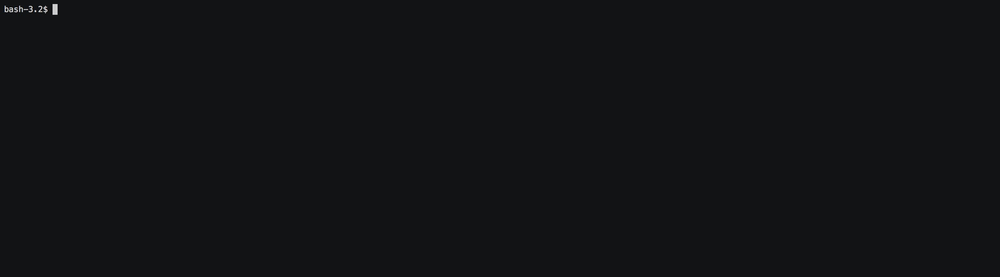

<h1>Brain Games</h1>

The collection of simple cli games.

Each game has 3 rounds to play. 
To win you should provide a correct solution in all of them!

<h2>Install</h2>

`npm install` to install dependencies

`npm link` to install the package binaries globally

<h2>Run</h2>

To run the game just type the game's name in the terminal and hit enter

<h2>Games</h2>

- `brain-even` - find if the given number is even

- `brain-calc` - calculate the correct result of the expression

- `brain-gcd` - find the greatest common divisor of two integers

- `brain-prime` - find if the number is prime

- `brain-progression` - find the missing element of arithmetic progression

